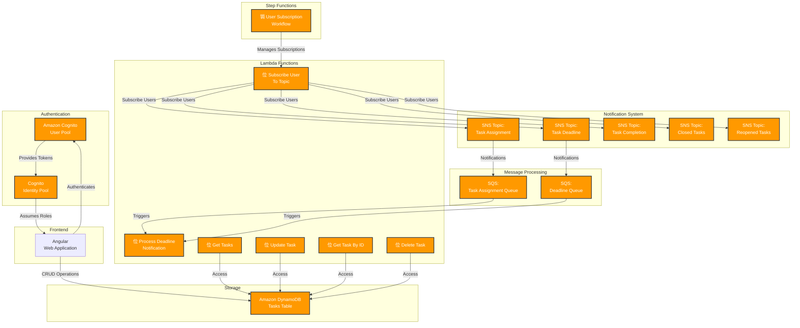

```mermaid

graph TB
    subgraph "Authentication" 
        Cognito[" Amazon Cognito<br/>User Pool"]
        IdentityPool[" Cognito<br/>Identity Pool"]
    end

    subgraph "Frontend"
        WebApp[" Angular<br/>Web Application"]
    end

    subgraph "Storage"
        DDB[" Amazon DynamoDB<br/>Tasks Table"]
    end

    subgraph "Notification System"
        SNS1[" SNS Topic:<br/>Task Assignment"]
        SNS2[" SNS Topic:<br/>Task Deadline"]
        SNS3[" SNS Topic:<br/>Task Completion"]
        SNS4[" SNS Topic:<br/>Closed Tasks"]
        SNS5[" SNS Topic:<br/>Reopened Tasks"]
    end

    subgraph "Message Processing"
        SQS1[" SQS:<br/>Task Assignment Queue"]
        SQS2[" SQS:<br/>Deadline Queue"]
    end

    subgraph "Step Functions"
        SF["锔 User Subscription<br/>Workflow"]
    end

    subgraph "Lambda Functions"
        L1["位 Subscribe User<br/>To Topic"]
        L2["位 Process Deadline<br/>Notification"]
        L3["位 Get Tasks"]
        L4["位 Update Task"]
        L5["位 Get Task By ID"]
        L6["位 Delete Task"]
    end

    %% Connections
    WebApp -->|"Authenticates"| Cognito
    Cognito -->|"Provides Tokens"| IdentityPool
    IdentityPool -->|"Assumes Roles"| WebApp

    WebApp -->|"CRUD Operations"| DDB
    L3 & L4 & L5 & L6 -->|"Access"| DDB

    SF -->|"Manages Subscriptions"| L1
    L1 -->|"Subscribe Users"| SNS1
    L1 -->|"Subscribe Users"| SNS2
    L1 -->|"Subscribe Users"| SNS3
    L1 -->|"Subscribe Users"| SNS4
    L1 -->|"Subscribe Users"| SNS5

    SNS1 -->|"Notifications"| SQS1
    SNS2 -->|"Notifications"| SQS2

    SQS1 -->|"Triggers"| L2
    SQS2 -->|"Triggers"| L2

    classDef aws fill:#FF9900,stroke:#232F3E,stroke-width:2px,color:white;
    class Cognito,IdentityPool,DDB,SNS1,SNS2,SNS3,SNS4,SNS5,SQS1,SQS2,SF,L1,L2,L3,L4,L5,L6 aws;

```